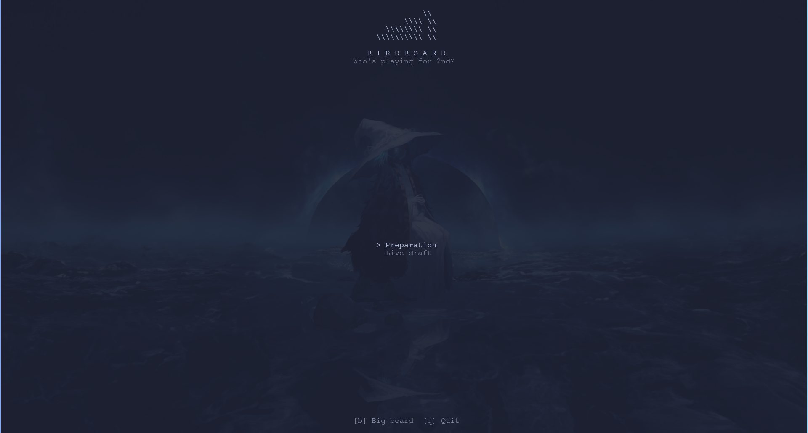
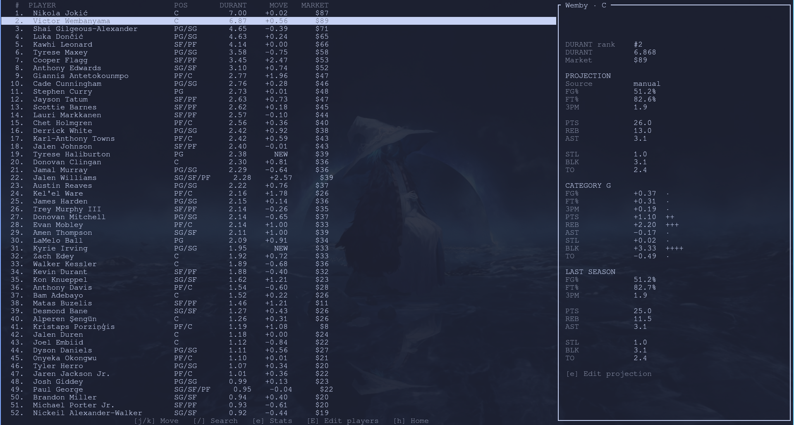
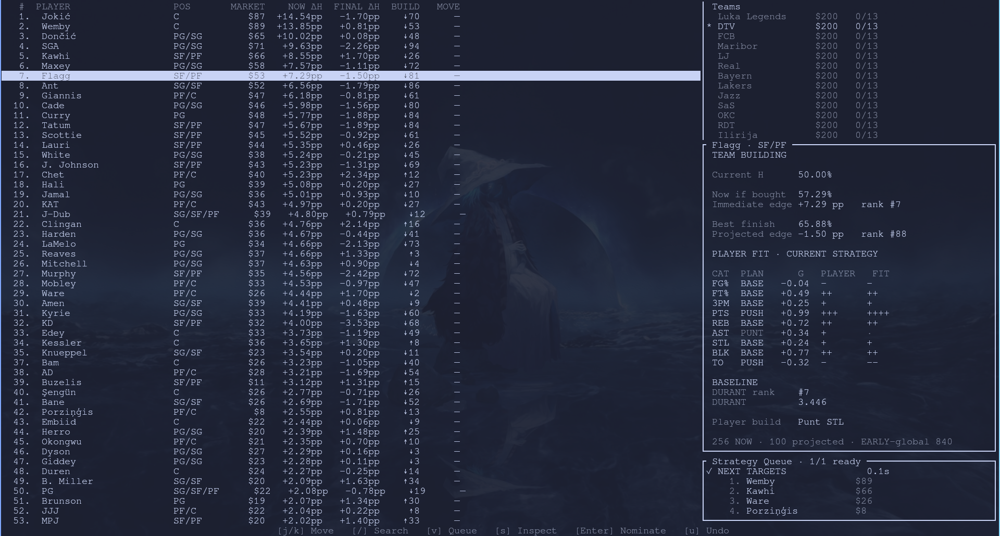
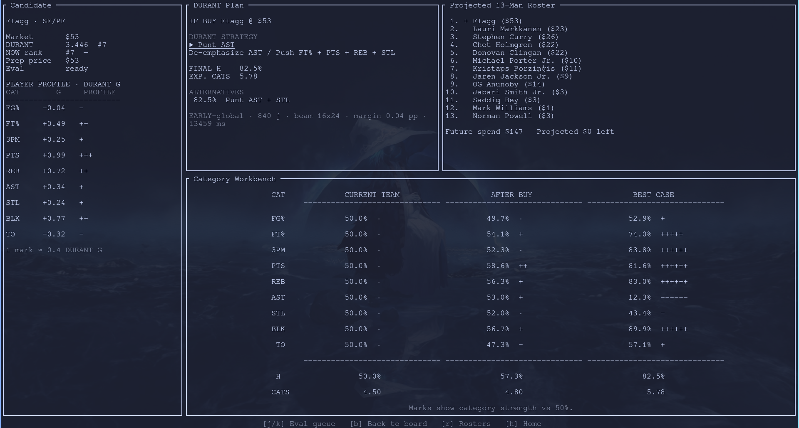
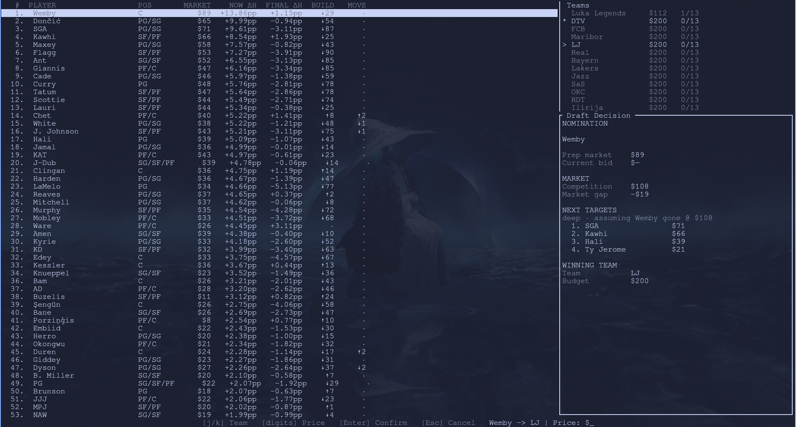
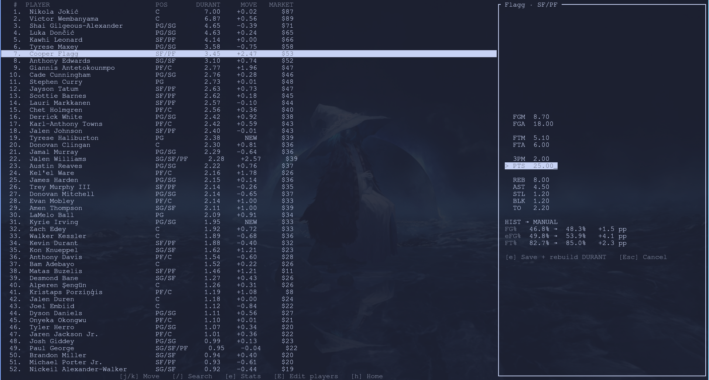

# BirdBoard

> **Who's playing for 2nd?**

**BirdBoard** is a keyboard-first NBA fantasy auction draft assistant built in Rust with Ratatui. It is designed for 9-category head-to-head salary-cap drafts and combines player projections, matchup probabilities, roster construction, market prices, and team-specific bidding advice in one terminal UI.

<p align="center">
  
</p>

BirdBoard is intentionally more than a ranked player list. It tries to answer four different draft questions separately:

- **How good is this player?** — `DURANT`, a category-aware player value model.
- **How much does this player help my team?** — `H` and `TEAM`, which evaluate weekly matchup strength and complete-roster construction.
- **What will the room probably pay?** — `MARKET`, an independent synthetic-auction price model.
- **How far should I actually bid?** — a roster-specific H-indifference reservation value rather than simply copying the market price.

The current project is opinionated around a **13-team, 13-player, $200, 9-cat H2H** league.

---

## Screenshots

### Preparation

The preparation board is the static pre-draft view: projections, DURANT, movement from the historical seed, and the production market price. The right panel shows the selected player's projection and category profile.

<p align="center">
  
</p>

### Live draft

Once the auction starts, the board becomes roster-aware. Players are evaluated against the current draft state rather than only by standalone value.

<p align="center">
  
</p>

### Deep strategy evaluation

Expensive candidate-specific work runs through a background queue. The Strategy screen shows the best build after buying the selected player, a projected 13-man roster, and category-level matchup probabilities.

<p align="center">
  
</p>

### Nomination / sale recording

The nomination view keeps expected competition, market gap, next targets, winning team, and sale entry together so the live board can update immediately after a pick.

<p align="center">
  
</p>

---

## How BirdBoard thinks

BirdBoard keeps several concepts deliberately separate:

```text
player projections
      │
      ▼
   DURANT ─────────────── standalone category value
      │
      ▼
      H  ─────────────── weekly 9-cat matchup strength
      │
      ▼
    TEAM ─────────────── roster-specific completion strategy
      │
      ├──────────────┐
      ▼              ▼
   MARKET         MAX BID
 expected room    highest price where
 clearing price   BUY still beats PASS
```

### DURANT

DURANT converts projected fantasy production into a common category-value scale. Percentage categories are volume-aware, turnovers are handled in the correct direction, and manual projections can be compared with the historical baseline without redefining the whole league environment.

### H

`H` is the matchup objective: the probability of winning at least five of the nine fantasy categories. It gives BirdBoard a team-level target instead of optimizing a raw sum of player scores.

### TEAM

TEAM searches for strong ways to finish the roster from the current auction state. The strategy can deliberately push, de-emphasize, coast, or punt categories when that improves the completed team's matchup outlook.

### MARKET

The production market is built from independent synthetic auctions between finite-budget, finite-roster managers. It predicts expected competitive cost; it is **not** the same thing as BirdBoard's willingness to pay.

### MAX BID

A max bid is a reservation price. BirdBoard compares the best future if the player is bought at a given price with the best future if the player is allowed to go. The ceiling is where those two futures become indifferent.

---

## Quick start

You need a Rust toolchain and the repository's data files.

```bash
cargo run --release
```

For development checks:

```bash
cargo fmt
cargo check
cargo test
```

BirdBoard expects its normal `data/` tree to be available, including the player/team data, weekly statistical history, strategy data, and the generated synthetic market artifact.

---

## Typical workflow

### 1. Prepare the board

From Home, select **Preparation** and press `b` for the Big Board.

Use `j` / `k` to move through players. Press `/` to search. Press `e` to edit the selected player's projection; saving rebuilds DURANT from the new line. `d d` removes a player from the curated preparation board and `u` restores the most recently removed player. `E` opens the broader player-editing mode.

The projection editor works with the fantasy inputs BirdBoard actually needs:

```text
FGM  FGA  FTM  FTA  3PM  PTS  REB  AST  STL  BLK  TO
```

<p align="center">
  
</p>

### 2. Start the live draft

Return Home with `h`, choose **Live draft**, and press `b`.

The first live calculation builds the current market-aware board and team plan. After that, BirdBoard reuses cached work where possible and recomputes when the auction state changes.

The main live columns are:

| Column | Meaning |
| --- | --- |
| `MARKET` | Expected competitive clearing price in the current room state. |
| `NOW ΔH` | Immediate change in matchup win probability if the player is bought now. |
| `FINAL ΔH` | Change after completing the roster optimally from that purchase. |
| `BUILD` | How the player's rank changes after considering full roster construction. `↑` means easier/better to build around; `↓` means the immediate appeal does not survive completion as well. |
| `MOVE` | Movement in live-board rank after the draft state changes. |

The right-hand panel breaks the selected player into current H, immediate H, projected finish, and category fit under the active strategy.

### 3. Queue deeper analysis

The fast live board is intended to remain responsive. Full strategy evaluation is explicit background work:

- `v` — add/remove the selected player from the Strategy Queue.
- `s` — open Strategy and ensure the selected player is queued.
- `j` / `k` — move through queued evaluations on the Strategy screen.
- `b` — return to the Big Board.

A completed evaluation produces a candidate-specific strategy, projected 13-man roster, category workbench, final H, expected categories won, and alternative strategy when one is close.

### 4. Record a sale

On the Live board, select the sold player and press `Enter`.

In recording mode:

- `j` / `k` selects the winning team.
- Type the sale price with the number keys.
- `Backspace` edits the price.
- `Enter` confirms the sale.
- `Esc` cancels.

After confirmation BirdBoard removes the player from the available pool, updates team budget/roster state, reprices the market, refreshes the live board, and uses queued/speculative work where available.

Use `u` from the normal Live board to undo the most recent recorded pick.

### 5. Inspect rosters

Press `r` during Live Draft to open the Rosters screen. Use `j` / `k` to move between teams. Editing tools are available with `E` when manual cleanup is needed.

---

## Keyboard reference

| Key | Context | Action |
| --- | --- | --- |
| `j` / `k` | most screens | move selection |
| `/` | Big Board | search players |
| `h` | browse screens | Home |
| `b` | Home / Strategy | Big Board |
| `r` | Live / Strategy | Rosters |
| `q` | normal browse | quit |
| `e` | Preparation | edit selected projection |
| `E` | Preparation / Rosters | toggle full edit mode |
| `d d` | Preparation | remove selected curated player |
| `u` | Preparation | restore last removed player |
| `v` | Live | toggle selected player in deep Strategy Queue |
| `s` | Live | inspect selected player in Strategy |
| `Enter` | Live | begin / confirm draft recording |
| digits | draft recording | enter sale price |
| `Backspace` | draft recording | edit sale price |
| `Esc` | draft recording | cancel |
| `u` | Live browse | undo last pick |

The footer in every screen is the authoritative context-sensitive shortcut guide.

---

## Data and generated artifacts

The project uses ordinary files rather than a database. The important pieces include:

```text
data/players.csv
    curated player board and manual projections

data/teams.csv
    league teams and budgets

data/stats/<season>/player_weekly.csv
    historical weekly fantasy production

data/market/<season>/equilibrium_prices.csv
    generated independent synthetic-auction MARKET prior
```

The market artifact is generated independently of ESPN prices. ESPN auction averages are used only in validation experiments, not to fit the production price curve.

---

## Design principles

**Do not confuse value with price.** A player can be underpriced by the room, overpriced for the current roster, or worth bidding past the expected market because the team's alternatives are worse.

**Optimize the completed roster, not thirteen isolated picks.** Immediate player quality matters, but the draft objective is a strong 13-man team under a finite budget.

**Keep expensive work off the critical path.** Fast analysis powers the board; deep searches can run in the Strategy Queue while the auction continues.

**Make assumptions visible.** Category profiles, build direction, expected market price, projected finish, and strategy roles are exposed in the TUI so surprising advice can be inspected rather than blindly trusted.

---

## Project status

BirdBoard began as a Rust/Ratatui learning project and grew into a personal draft-day research tool. The core economic model is now centered on the synthetic MARKET + H-indifference bidding architecture; current work is primarily hardening the live-draft experience, validating player-level assumptions, and improving reliability rather than continually adding new pricing heuristics.

This repository is a fantasy-basketball analysis project and is not affiliated with the NBA or ESPN.
